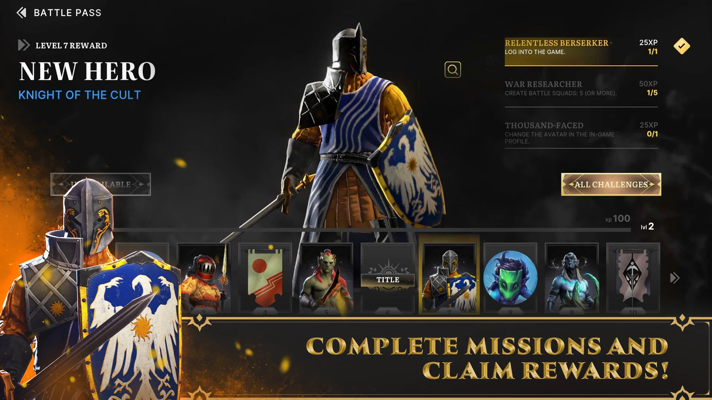
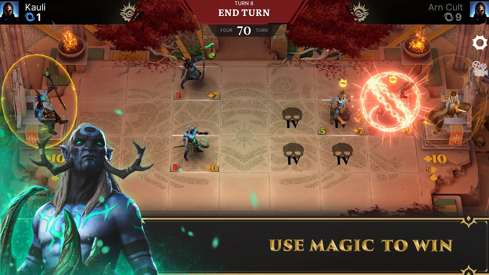
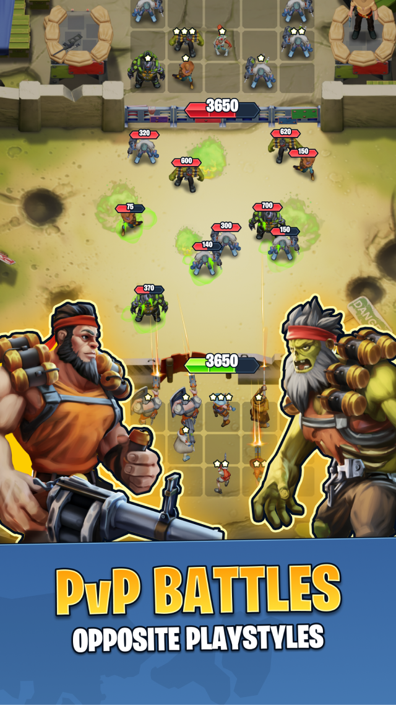
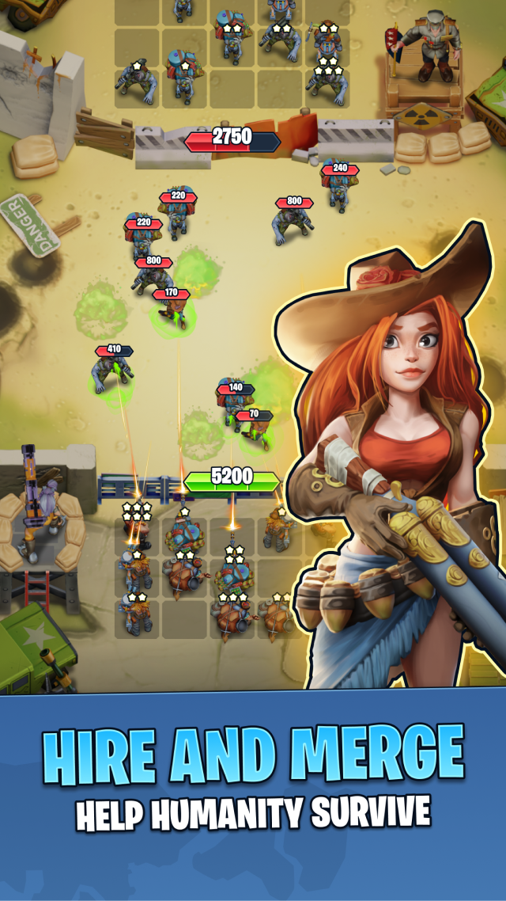
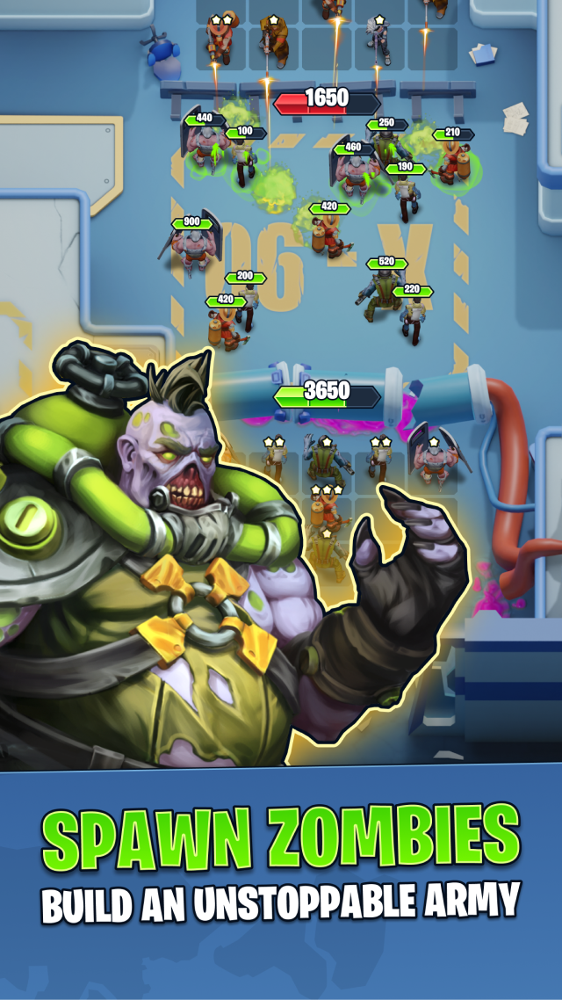
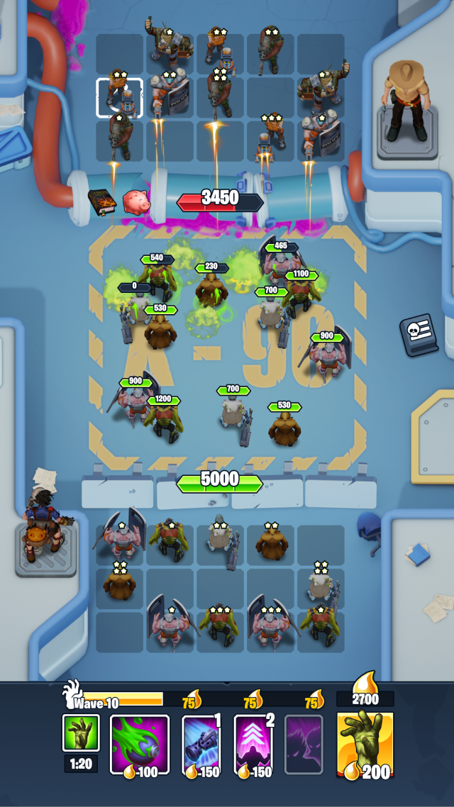

# Hello, I'm new one here)

## Projects

    <h4 align="center"> 
<a href="https://play.google.com/store/apps/details?id=com.BulatZavgarov.HeroicBattles&hl=en">Heroes of Artadis</a></h4>
    

        Heroes of Artadis is a free-to-play turn-based online strategy with CCG elements. 
        The game combines the elements of a collectible card game and classic strategy.    
        
        
        
        
    

---

    <h4 align="center"> <a href="https://play.google.com/store/apps/details?id=com.NeonBanana.PVPTD&hl=en&gl=US">Merge Punk</a></h4>
    

        Merge Punk combines elements of Tower Defense and Tower Attack game!. 
        Build, merge, upgrade, defend or attack – everything is in your hands!    
        
        
        
        
    

---

