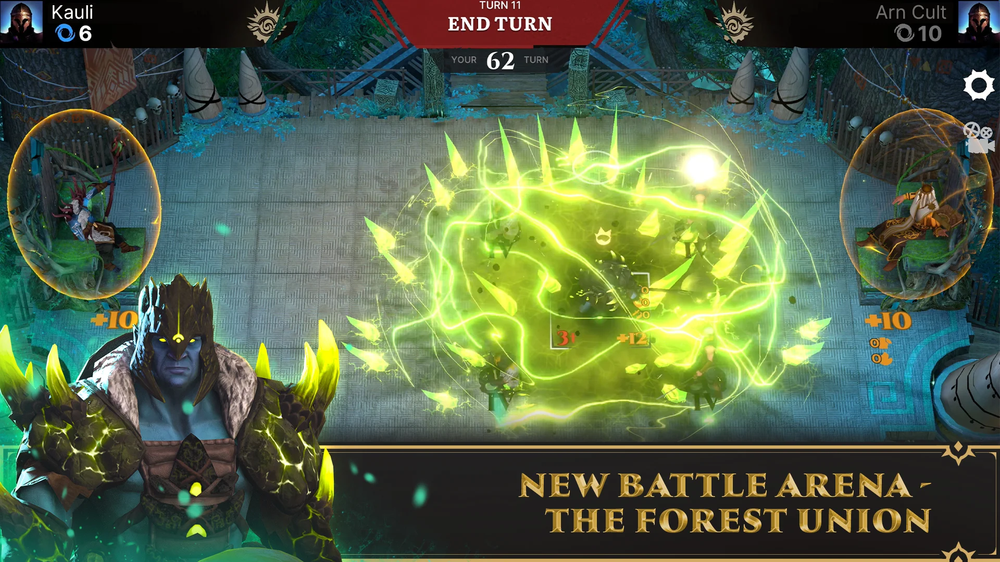

<h1 align="center"> Linar Khilazhev Portfolio </h1>

<h2 align="center"> Commercial projects</h2>

    <h2 align="center"> <a href="https://play.google.com/store/apps/details?id=com.BulatZavgarov.HeroicBattles&hl=en">Heroes of Artadis</a></h2>
    

        Heroes of Artadis is a free-to-play turn-based online strategy with CCG elements. 
        The game combines the elements of a collectible card game and classic strategy.    
        
        
        
        
    

---

    <h2 align="center"> <a href="https://play.google.com/store/apps/details?id=com.NeonBanana.PVPTD&hl=en&gl=US">Merge Punk</a></h2>
    

        Merge Punk combines elements of Tower Defense and Tower Attack game!. 
        Build, merge, upgrade, defend or attack – everything is in your hands!    
        
        
        
    

---

<h2 align="center"> Jams Projects</h2>

---

    <h2 align="center"> <a href="https://linzet.itch.io/avel">AveL</a></h2>
    

        AveL simple puzzle platform game about two brothers boxes!.   
        
        
    

---

    <h2 align="center"> <a href="https://linzet.itch.io/thief-cracker">Thief Cracker</a></h2>
    

"Thief Cracker" is a bold platformer where you solve math puzzles to outsmart traps and claim the ultimate prize!   
        
        
    

---